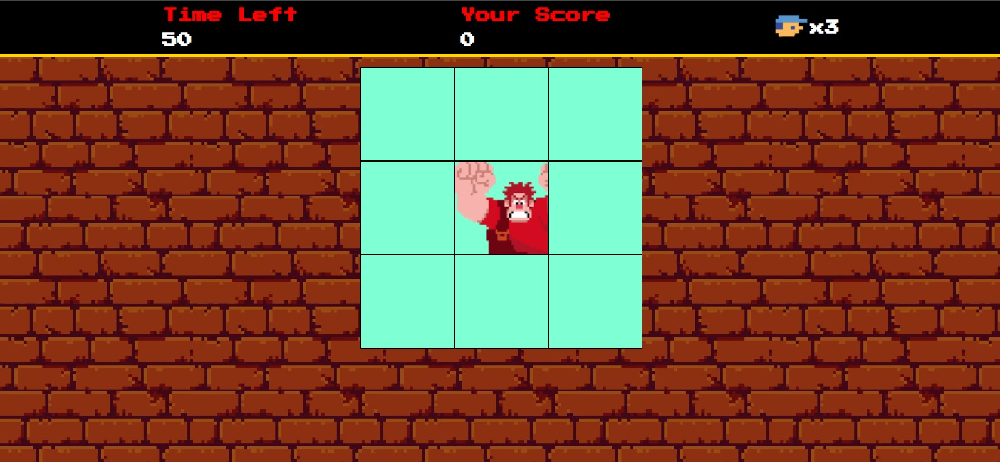
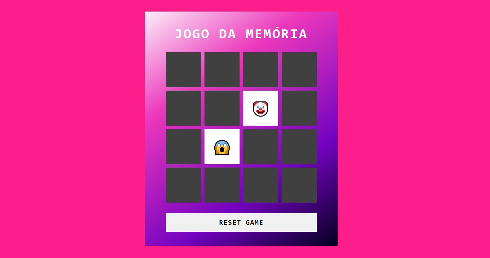
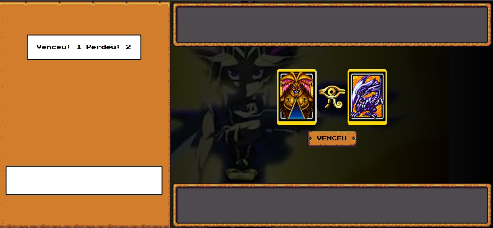
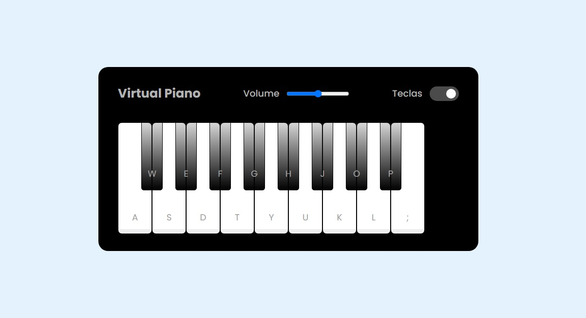

## Este repositório contém os projetos desenvolvidos durante o Bootcamp "Desenvolvimento de Jogos" promovido pelo iFood em parceria com a Digital Innovation One. O objetivo principal é aplicar, na prática, os conhecimentos adquiridos sobre desenvolvimento front-end por meio da criação de jogos interativos utilizando as tecnologias fundamentais da web: HTML5, CSS3 e JavaScript.

# Jogo Detona Ralph

# Jogo da Memória

# Jogo de Cartas Yu-Gi-Oh

# Simulador de Piano

